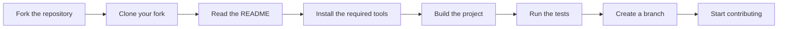

# Contributing to Plizent

Thank you for your interest in contributing to **Plizent**.

We welcome all kinds of contributions, including bug reports, feature ideas, documentation improvements, code, testing, and community support.

Before participating in our community, please read and follow our [Code of Conduct](CODE_OF_CONDUCT.md). We are committed to maintaining a welcoming, respectful, and inclusive environment for everyone.

Every contribution helps improve our projects and community.

To learn more about our organization, goals, and projects, see our [Organization Profile](profile/README.md).

---

## Ways to Contribute

You can contribute by:

- Reporting bugs
- Suggesting new features
- Improving documentation
- Fixing issues
- Adding or improving tests
- Reviewing pull requests
- Joining discussions

> [!TIP]
> You don't need to write code to make a valuable contribution.

---

## Before You Start

Before opening an issue or pull request:

- Read the project documentation.
- Search existing issues and pull requests.
- Follow our [Code of Conduct](CODE_OF_CONDUCT.md).
- Make sure your contribution aligns with the project's goals.
- If you're new, look for issues labeled `good-first-issue` or `help-wanted`.

If you're planning to work on a new feature, a major change, or anything that may affect the project's direction, please open an issue first. This helps avoid duplicate work, encourages discussion, and ensures your proposal aligns with the project's goals.

---

## Development Setup

Each repository may use a different programming language, framework, or development tools.

Before you start contributing, read the repository's **README** for the required setup instructions.



### Prerequisites

Before building a project, make sure you have:

- Git installed
- A supported operating system
- Internet access to download project dependencies
- Any tools required by the repository

> [!IMPORTANT]
> Every repository documents its own requirements, such as supported language versions, development tools, containers, or platform-specific notes. Always follow the repository's **README**.

### Clone the Repository

```bash
git clone https://github.com/<organization>/<repository>.git
cd <repository>
```

### Build and Test

Build the project and run the tests by following the instructions in the repository's **README**.

Before opening a pull request, make sure:

- The project builds successfully.
- All tests pass.
- Documentation is updated when needed.
- Any formatting or linting checks pass.

> [!TIP]
> If the repository provides build scripts or automation, use them instead of running commands manually.

---

## Submitting Changes

When opening a pull request:

- Keep your changes focused on one topic.
- Follow the project's coding and documentation standards.
- Update documentation when needed.
- Use a branch name that follows our [Branch Naming Convention](#branch-naming-convention).
- Write commit messages that follow our [Commit Message Convention](#commit-message-convention).
- Make sure all checks pass before requesting a review.

> [!NOTE]
> For large changes, please open an issue first to discuss your proposal.

---

## Branching Strategy

Plizent follows a **trunk-based development** workflow. All changes should be made in a separate branch and submitted through a pull request.

Direct pushes to protected branches are not allowed. This helps ensure that every change is reviewed, tested, and meets the project's quality standards before it is merged.

### Branch Naming Convention

Use the following format for branch names:

```text
<type>/<short-description>
<type>/<issue-number>-<short-description>
```

**Rules:**

- Use lowercase letters only.
- Separate words with hyphens (`-`), never use underscores or spaces.
- Keep the branch name short and descriptive.
- Include the related issue number when one exists.

### Branch Types

| Type | Use for |
|------|---------|
| `feat` | A new feature |
| `fix` | A bug fix |
| `docs` | Documentation changes |
| `refactor` | Code improvements without changing behavior |
| `perf` | Performance improvements |
| `test` | Adding or updating tests |
| `build` | Build system or dependency changes |
| `ci` | CI/CD configuration changes |
| `chore` | Maintenance tasks |
| `hotfix` | Urgent fixes for released versions |
| `release` | Release preparation |

### Examples

```text
feat/42-add-circuit-breaker
fix/107-null-pointer-order-service
docs/update-readme
refactor/simplify-event-bus
chore/update-dependencies
release/v1.4.0
```

> [!NOTE]
> Branch protection rules may prevent direct pushes, force pushes, or merging without required checks and reviews. These rules help keep the project's history clean and ensure that every change is reviewed before it reaches a protected branch.

---

## Commit Message Convention

<!-- This project follows the [Conventional Commits](https://www.conventionalcommits.org/) specification. -->

Using a consistent commit message format helps us review changes, generate release notes, maintain the project history, and automate tasks such as versioning.

### Format

```text
<type>(<scope>): <short summary>

[optional body]

[optional footer(s)]
```

### Rules

- Use the imperative, present tense (for example, `add` instead of `added` or `adds`).
- Don't capitalize the first letter of the summary.
- Don't end the summary with a period (`.`).
- Keep the summary short and descriptive (ideally under 50 characters).
- Wrap the body at about 72 characters per line.
- `scope` is optional but recommended. Use the affected module, package, or project area.
- Use the footer for breaking changes and issue references:
  - `BREAKING CHANGE: <description>`
  - `Closes #123`
  - `Refs #123`

### Types

Use the same commit types as the branch types:

`feat`, `fix`, `docs`, `style`, `refactor`, `perf`, `test`, `build`, `ci`, `chore`, and `revert`.

### Examples

```text
feat(auth): add JWT refresh token rotation

fix(api): correct pagination offset bug

docs(readme): update setup instructions

chore(deps): bump spring-boot to 3.3.4

refactor(event-bus)!: replace synchronous dispatch with async queue

BREAKING CHANGE: EventBus.publish() no longer blocks; consumers must
subscribe using the new asynchronous handler interface.

Closes #88
```

> [!TIP]
> A `!` after the type or scope (for example, `refactor(event-bus)!:`) indicates a breaking change. Always include a `BREAKING CHANGE:` footer to explain what changed.

---

## Code Style & Quality Standards

To help keep our projects consistent and maintainable, please follow the coding and documentation standards used by each repository.

- Follow the repository's coding standards and style guides.
- Respect the project's formatting and linting rules.
- Follow the settings defined in [.editorconfig](.editorconfig), when available.
- Write or update tests when your changes affect existing or new functionality.
- Update documentation when your changes affect users or contributors.

> [!NOTE]
> Language-specific coding standards and development guidelines are documented in each repository. Please follow the repository's documentation instead of applying a common style across all projects.

---

## Pull Request Process

Before opening a pull request, make sure:

- Your changes are complete and focused on a single topic.
- The project builds successfully.
- All required checks and tests pass.
- Documentation is updated when needed.
- There are no unresolved review comments.

If the repository provides a pull request template, please complete it when opening your pull request.

All pull requests require at least one maintainer review before they can be merged.

Unless a repository specifies otherwise, pull requests are merged using **Squash and Merge** to keep the commit history clean and easy to follow.

> [!NOTE]
> Some repositories run automated validation, testing, formatting, linting, or security checks before a pull request can be merged. These checks must pass before your contribution can be reviewed or accepted.

### Review Process

All pull requests are reviewed by the maintainers.

During review, we consider:

- Code quality
- Security
- Performance
- Documentation
- Maintainability
- Project goals

Maintainers may request changes before merging.

---

## Security

Please do **not** report security vulnerabilities through public GitHub issues or discussions.

If you discover a security issue, follow the reporting process described in [SECURITY.md](SECURITY.md).

Responsible disclosure helps protect our users while a fix is being prepared.

---

## License

By contributing, you agree that your work will be licensed under this repository's [LICENSE](LICENSE).

---

## Recognition

Every contribution matters, no matter how big or small.

Contributors may be recognized through GitHub's contributor history, contributor lists, release notes, acknowledgements, or other project documentation, depending on the repository.

Thank you for helping make **Plizent** better.

---

## Need Help?

- Read the [README](README.md)
- Follow our [CODE_OF_CONDUCT.md](CODE_OF_CONDUCT.md)
- Report security issues in [SECURITY.md](SECURITY.md)
- Get help through [SUPPORT.md](SUPPORT.md)

Thank you for helping make **Plizent** better!
